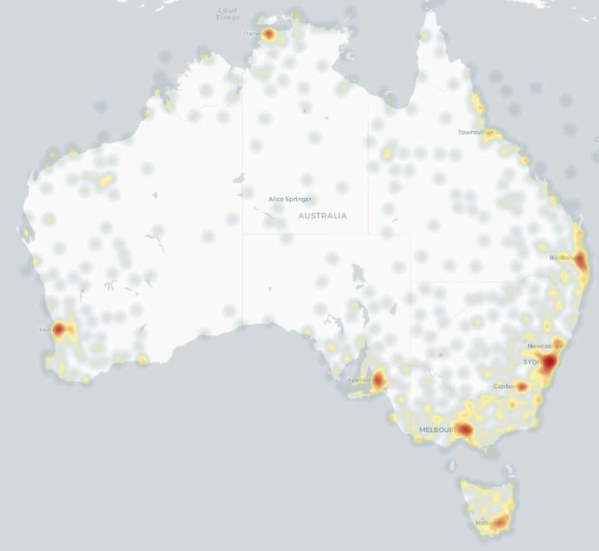
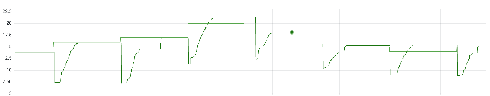

# bom_exporter - Prometheus exporter for the Australian Bureau of Meteorology

A Prometheus compatible exporter for forecast and observation data published by
the Australian Bureau of Meteorology.

The exporter adapts the forecast and observation data feeds (from the anonymous
FTP BOM server) into promscrape compatible format.

# Screenshots

## Heatmap

Using latitude, longitude and ambient temperature observations a heatmap of
Australia can be generated using Grafana's Geomap panel.

Note: The hot areas around capital cities are indicative of denser station
presence rather than actual heat.



## Forecast vs Actual

Using the daily forecast (index 0), we can compare the predicted maximum against
the actual maximum observed. We can see in this instance the forecast isn't
terribly wrong, usually.



With some PromQL the data could be summarised and displayed as a per day
difference.

# Metrics

Help text is available for all metrics when scraped.
Following is a quick summary of the metrics currently exported.

## Forecast

| Metric Name | Unique Labels | Description |
| ----------- | ------------- | ----------- |
| bom_forecast_air_temperature | units, type | Air temperature specified in 'units' and 'type' (eg. minimum, maximum) |
| bom_forecast_icon_code | | Forecast icon code (see http://reg.bom.gov.au/info/forecast_icons.shtml) |
| bom_forecast_precipitation_probability | | Probability of precipitation |
| bom_forecast_precis | precis | Value is 1 if present, the precis label holds the textual description of the forecast |

The following labels are common to all forecast metrics:

| Label | Description |
| ----- | ----------- |
| identifier | Product identifier |
| aac | AAC |
| parent_aac | Parent AAC |
| description | City |
| region | State |
| index | Day offset (0 being today) |

## Observations

| Metric Name | Unique Labels | Description |
| ----------- | ------------- | ----------- |
| bom_observations_cloud_base | units | Cloud base altitude in 'units' |
| bom_observations_cloud_cover | units | Cloud cover in 'units' |
| bom_observations_humidity | units | Humidity in 'units' |
| bom_observations_pressure | type, units | Pressure in 'units' |
| bom_observations_rainfall | units | Rainfall since 9am |
| bom_observations_temperature | type, units | Temperature in 'units', where 'type' can be dew_point, ambient, apparent, maximum, minimum, delta_t |
| bom_observations_visibility | units | Distance of visibility in 'units' |
| bom_observations_wind_direction | units | Wind direction in 'units' |
| bom_observations_wind_speed | type, units |  Wind speed in 'units', where 'type' can be average, gust |

The following labels are common to all observations metrics:

| Label | Description |
| ----- | ----------- |
| identifier | Product identifier |
| bom_id | BOM station ID |
| wmo_id | WMO station ID |
| station_name | Text name of the station |
| latitude | Latitude of the station |
| longitude | Longitude of the station |
| description | Human-readable description of the station |
| region | State |
| index | Seems to always be 0 |

## Build
```
go build cmd/bom_exporter.go
```

A binary called `bom_exporter` should be compiled.

## Test
```
go test ./...
```

# Usage

## Scraping Data
`bom_exporter` will serve forecast and observations scrape data on the following
URL:
```
http://<server>:8080/metrics?id=<product_id>
```
Where the product identifier can be obtained from:
http://www.bom.gov.au/catalogue/anon-ftp.shtml

The following product identifier types are currently supported:
- forecast
- observations

## Scrape Configuration
Data is retrieved from the BoM on request, thus the configured scrape interval
controls the frequency at which the BoM FTP server is accessed.
It is recommended to match the scrape interval with the product being accessed:
- observations - scrape every 5 minutes, updated every 10 minutes
- forecast - scrape every 1-6 hours, updated every 12(?) hours

### Example Scrape Single Product
Following is the configuration snippet to scrape the Sydney city forecast
(IDN10064) hourly.
```
  - job_name: bom_forecast
    scrape_interval: 1h
    metrics_path: /metrics
    params:
      id: ['IDN10064']
    static_configs:
      - targets: ['localhost:8080']
```

### Example Scrape Multiple Products
Following is the configuration snippet to scrape all the state observations
every 5 minutes:
```
  - job_name: bom_observations
    scrape_interval: 5m
    metrics_path: /metrics
    static_configs:
      - targets:
        - 'IDS60920'
        - 'IDN60920'
        - 'IDD60920'
        - 'IDQ60920'
        - 'IDT60920'
        - 'IDV60920'
        - 'IDW60920'
    relabel_configs:
      - source_labels: [__address__]
        target_label: __param_id
      - source_labels: [__param_id]
        target_label: instance
      - target_label: __address__
        replacement: localhost:8080
```

## Motivation
I've always wanted to have longer term climate data available with a user
interface that I have familiarity (Grafana).

## Known Issues/Future Ideas
- Using a scrape interval >5 minutes results in Prometheus staleness
  - Cache the data and timestamps internally
  - Disconnect the external scrape interval from the data retrieval and use the
     'next issue time' to intelligently schedule the next FTP retrieval.
- Support other products, eg. tides
  - Decode more metrics (eg. rainfall quantity forecast)
- Release a Docker image
  - Look into goreleaser
- Improve test coverage
- Add continuous integration
